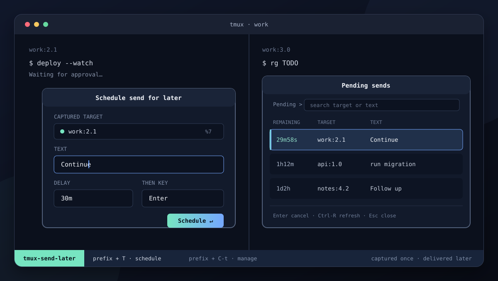

# tmux-lagput

[](https://github.com/hongymagic/tmux-lagput/actions/workflows/ci.yml)
[](https://github.com/hongymagic/tmux-lagput/releases/latest)
[](LICENSE)

**Schedule text for the pane you are in, then keep working.**

`tmux-lagput` is a tmux-native command palette for delayed pane input. It
captures the pane that opened the popup, accepts a human-readable delay, and
sends the text back to that exact pane even if your focus has moved elsewhere.



## Why lagput?

- **Native workflow:** both scheduling and job management live in tmux popups.
- **Stable targeting:** jobs keep the captured pane and tmux server identity;
  they never follow the currently focused pane.
- **Human delays:** use `90s`, `30m`, `5h`, `1d2h`, or any combination of days,
  hours, minutes, and seconds.
- **Dependency-light:** the plain Bash interface is always available. fzf and
  gum are optional enhancements.
- **Cancellable:** review pending sends, inspect their destination and due time,
  then cancel with confirmation.
- **Cross-platform:** detached background jobs work on Linux and macOS, with
  optional persistent systemd user timers on Linux.

## Install

### TPM

With [TPM](https://github.com/tmux-plugins/tpm) installed, add the plugin before
its initialisation line in `~/.tmux.conf`:

```tmux
set -g @plugin 'hongymagic/tmux-lagput'

# Keep this as the final plugin line.
run '~/.tmux/plugins/tpm/tpm'
```

Reload tmux, then press `prefix + I` to install:

```sh
tmux source-file ~/.tmux.conf
```

### Manual

Clone the repository and load its root `.tmux` file:

```sh
git clone --depth 1 https://github.com/hongymagic/tmux-lagput.git \
  ~/.tmux/plugins/tmux-lagput
```

```tmux
# ~/.tmux.conf
run-shell ~/.tmux/plugins/tmux-lagput/tmux-lagput.tmux
```

Then reload the configuration:

```sh
tmux source-file ~/.tmux.conf
```

## Use

### Schedule a send

Press `prefix + T`, then complete the form:

1. Enter the literal text to send.
2. Enter a delay such as `30m` or `1d2h`.
3. Enter the tmux key to send afterwards. The default is `Enter`; use `none`
   to send only the text.
4. Review the captured target and submit.

Empty text and invalid durations are shown as inline errors without closing the
popup. Press Esc at any field or review prompt to leave without creating a job.
A tmux status message confirms a successful schedule after the popup closes.

> [!CAUTION]
> `Enter` can execute the scheduled text in a shell or application. Check the
> target and text in the review screen before submitting.

### Manage pending sends

Press `prefix + C-t` to open the pending-send palette. Each row includes the
remaining time, captured target, and text. Select a job to inspect its pane ID,
exact run time, trailing key, backend, and job ID before confirming
cancellation.

The palette uses fzf when available, then gum, then a numbered Bash interface:

| Interface | Controls |
| --- | --- |
| fzf | `Enter`/`Ctrl-X`: review; `Ctrl-R`: refresh; Esc: close. |
| gum | Filter and select a row, then confirm the cancellation. |
| Plain Bash | Number: review; `r`: refresh; `q`/Esc: close. |

### Default bindings

| Binding | Action |
| --- | --- |
| `prefix + T` | Schedule delayed pane input. |
| `prefix + C-t` | List, inspect, and cancel pending sends. |

tmux treats uppercase `T` and Shift+T as the same key, so they cannot be two
different default bindings. To use a lowercase/uppercase pair, configure `t`
and `T` explicitly. Stock tmux binds lowercase `prefix + t` to `clock-mode`, so
choosing `t` deliberately replaces the clock. Inspect a candidate first with
`tmux list-keys -T prefix t` (substitute the key you plan to use).

## Requirements and compatibility

| Component | Support |
| --- | --- |
| tmux | 3.3a or newer. |
| Bash | 3.2 or newer, including the Bash shipped with macOS. |
| Linux | Background scheduling; optional systemd user timers. |
| macOS | Background scheduling; systemd is not used. |
| `nohup` | Required for the default detached worker. |
| `setsid` | Optional; used for stronger detachment when available. |
| [fzf](https://github.com/junegunn/fzf) | Optional pending-job search and preview. |
| [gum](https://github.com/charmbracelet/gum) | Optional polished form and fallback fuzzy filter. |

CI exercises current Ubuntu and macOS runners, including the dependency-free
fallbacks, and smoke-tests the minimum supported tmux 3.3a release.

## Configure

Set options before TPM's initialisation line, then reload `~/.tmux.conf`:

```tmux
# Use prefix + t to schedule and prefix + T to manage jobs.
set -g @send-delayed-key 't'
set -g @send-delayed-list-key 'T'

# Disable either binding while retaining the other one.
# set -g @send-delayed-list-key 'none'

# Popup geometry and border style.
set -g @send-delayed-popup-width '70%'
set -g @send-delayed-popup-height '16'
set -g @send-delayed-list-popup-width '80%'
set -g @send-delayed-list-popup-height '70%'
set -g @send-delayed-popup-border-lines 'rounded'

# Linux only: prefer persistent systemd user timers.
set -g @send-delayed-use-systemd 'on'

# Optional absolute state directory.
set -g @send-delayed-state-dir '/home/me/.local/state/tmux-lagput'
```

- `@send-delayed-key` (`T`) — schedule-popup binding. `none` or `off`
  disables it.
- `@send-delayed-list-key` (`C-t`) — pending-jobs binding. `none` or `off`
  disables it.
- `@send-delayed-popup-width` (`70%`) — schedule-popup width accepted by tmux.
- `@send-delayed-popup-height` (`16`) — schedule-popup height accepted by tmux.
- `@send-delayed-list-popup-width` (`80%`) — pending-jobs popup width.
- `@send-delayed-list-popup-height` (`70%`) — pending-jobs popup height.
- `@send-delayed-popup-border-lines` (`rounded`) — popup border style.
  `default` inherits tmux's setting.
- `@send-delayed-use-systemd` (`off`) — prefer systemd on Linux. `1`, `on`,
  `yes`, and `true` enable it.
- `@send-delayed-state-dir`
  (`${XDG_STATE_HOME:-$HOME/.local/state}/tmux-lagput`) — absolute job-state
  and history directory.

## How scheduling works

The binding passes the triggering `#{pane_id}` and `#{client_name}` into the
popup. The display target is resolved immediately for review, while the
immutable pane ID and tmux socket identity are persisted with the job. At the
due time, lagput verifies both identities before sending literal text and the
optional trailing key.

The default backend starts a detached worker with `nohup` and uses `setsid`
when it is present. Job publication, execution, and cancellation use atomic
directory moves so only one operation can claim a pending send.

With `@send-delayed-use-systemd on`, Linux prefers a per-job user service and
timer under `${XDG_CONFIG_HOME:-$HOME/.config}/systemd/user/`. Each timer uses
`Persistent=true`; if the user systemd manager is unavailable or setup fails,
lagput falls back to the background worker after confirming any partial unit
setup was removed. If it cannot safely disarm a partial timer, scheduling fails
closed and retains metadata for `scripts/cleanup.sh` to retry. A reboot cannot
restore a tmux pane, so an overdue timer records a failure when its captured
destination no longer exists rather than sending somewhere else.

## State, history, and privacy

The default state directory is:

```text
${XDG_STATE_HOME:-$HOME/.local/state}/tmux-lagput
```

Pending text, trailing keys, pane and socket identifiers, backend metadata, and
`jobs-history.log` are stored there as **plaintext**. New state is created with
a user-only `umask 077`, but custom or pre-existing directories and backups
remain your responsibility. Avoid scheduling secrets if plaintext local
storage is unsuitable.

The history log records a UTC timestamp, job ID, outcome, display target, and
detail for sent, failed, and cancelled jobs. Missing panes and changed tmux
servers are recorded instead of failing silently. lagput does not include
telemetry and does not make network requests.

See the [security policy](SECURITY.md) for the full trust and data model.

## Upgrade

Releases use CalVer `YYYY.MMDD.PATCH`; Git tags add a leading `v`. Read the
[changelog](CHANGELOG.md), then update with TPM using `prefix + U`. For a manual
installation:

```sh
git -C ~/.tmux/plugins/tmux-lagput pull --ff-only
tmux source-file ~/.tmux.conf
```

## Uninstall

Stop pending workers, disable generated systemd units, and retain the history
for review **before** removing the plugin files:

```sh
~/.tmux/plugins/tmux-lagput/scripts/cleanup.sh
```

Cleanup also blocks new scheduling through any popup that was already open.
Loading the plugin again removes that block, so a cancelled uninstall can be
recovered by sourcing `~/.tmux.conf` while the plugin line is still present.

Remove the plugin line from `~/.tmux.conf`. With TPM, press `prefix + Alt-u` to
remove plugins no longer listed; for a manual installation, remove the cloned
directory. Reload tmux afterwards. Cleanup deliberately retains the state
directory and `jobs-history.log`; delete that directory separately only after
reviewing its plaintext contents and any custom `@send-delayed-state-dir`.

## Troubleshooting

### The popup does not open

- Confirm `tmux -V` reports 3.3a or newer.
- Reload the configuration with `tmux source-file ~/.tmux.conf`.
- Check that the plugin line appears before TPM's initialisation line.
- Inspect `tmux list-keys -N` for `Schedule delayed pane input` and
  `Manage delayed pane input`.
- Check for another plugin or configuration using the same binding, then set
  `@send-delayed-key` or `@send-delayed-list-key` explicitly.

### A scheduled send did not arrive

The original pane or tmux server may no longer exist. Check
`jobs-history.log` in the configured state directory for the recorded outcome.
lagput intentionally refuses to retarget a job to a new or currently focused
pane.

### fzf or gum is installed but not selected

Long-running tmux servers may have an older `PATH`. Restart the tmux server, or
update its environment so `command -v fzf` or `command -v gum` succeeds inside
a pane. Both integrations remain optional.

### systemd falls back to a background worker

Systemd scheduling requires Linux and a working user manager (`systemctl --user
show-environment`). Open a job's detail view to see the backend in use. A
missing user manager, unit setup failure, or macOS causes an automatic fallback
to the detached worker when any partial unit setup can be safely removed.

For more diagnostic guidance, see [Support](SUPPORT.md).

## Contributing

Contributions are welcome. Start with [CONTRIBUTING.md](CONTRIBUTING.md), follow
the [Code of Conduct](CODE_OF_CONDUCT.md), and report vulnerabilities through
the private process in [SECURITY.md](SECURITY.md).

tmux-lagput is available under the [MIT Licence](LICENSE).
